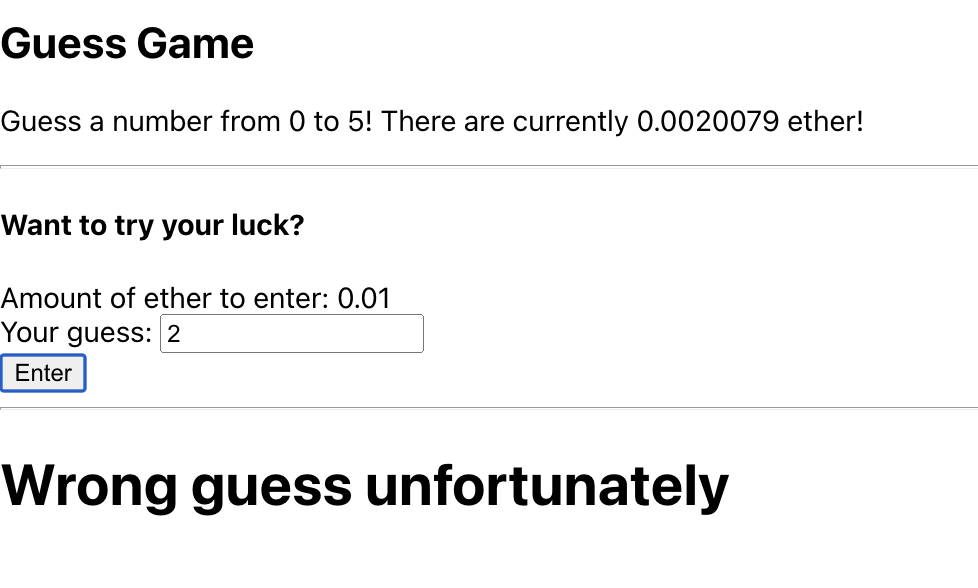

# Guess game on Rinkeby testnet

This is a guess game deployed on Rinkeby test network that people get rewarded if they guessed the correct number. The range of number will become smaller base on each guess and the amount of ether required will become larger. 

Once the correct guess is made, the range of numbers will be reset to initial state.

<a href="https://chrome.google.com/webstore/detail/metamask/nkbihfbeogaeaoehlefnkodbefgpgknn" target="_blank">Metamask</a>
 should be installed in your browser prior to entering the game!

## Run an react app locally

<b>Go to guess-react-frontend</b></br>
Run:
```
$ npm install
```
Then:
```
$ npm start
```

Your app should start, then go to localhost:3000

You'll see home page:

There will be range of numbers to guess and total reward to win for correct guess.

</br>

Metamask pops out once guessing a number.

</br>

Need to wait for the transaction to process when enter a number.

</br>

Get a wrong guess message if you made a wrong guess.

</br>

The range of number will be updated if a wrong guess is made. You'll get a congrats message if you made a correct guess.

</br>

9/10 amount of money in transaction will be sent to the winner as reward, the range of number will be reset to start a new round of guess game!

</br>

<hr>
## Guess game contract in solidity

The contract is written in solidy. First define contract GuessGame:

```
contract GuessGame {

}   
```

In the GuessGame object, we defined some variables:

```
uint public initUpperLimit;
uint public lowerLimit;
uint public upperLimit;
uint private ans;
bool public isInit;
```

Contructor initiate upperlimit, answer and initial state by input number:

```
constructor(uint num) {
    initUpperLimit = num;
    generateAnswer();
    isInit = true;
}
```

generateAnswer() generated some random number between the range of 0 to the input number in the constructor.

```
function generateAnswer() private {
    ans = uint(keccak256(abi.encodePacked(block.difficulty, block.timestamp))) % initUpperLimit;
    lowerLimit = 0;
    upperLimit = initUpperLimit;
    }
```

guess(uint num) function pass the input an guess number. The guess number is required to be in the given range.</br>
Also, the amount of ether sent should be greater than 0.01 ether and the total balance / 10.</br>

Making guess after many guesses should be easier, so it cost more (total balance / 10) than guessing at the start.</br>

If a correct guess is made, the 9/10 ether in the pool will be transfered to the winner. The contract saves 1/10 to attract the people to guess for the next round lol.</br>

If a wrong guess is made, update the range of numbers base on the guess.


```
function guess(uint num) public payable {
    require(msg.value >= .01 ether && msg.value >= address(this).balance / 10 && num >= lowerLimit && num <= upperLimit);
    if (num == ans) {
        payable(msg.sender).transfer(address(this).balance * 9 / 10);
        generateAnswer();
        isInit = true;
        return;
    } else if (ans > num) {
        lowerLimit = num + 1;
    } else {
        upperLimit = num - 1;
    }
    isInit = false;
}
```

Overall the contract looks like:

```
pragma solidity ^0.8.9;

contract GuessGame {
    uint public initUpperLimit;
    uint public lowerLimit;
    uint public upperLimit;
    uint private ans;
    // isInit represent the state of guessGame, if the correct guess is made, 
    // the contract will return to initial state.
    bool public isInit;
    
    constructor(uint num) {
        initUpperLimit = num;
        generateAnswer();
        isInit = true;
    }
    
    function guess(uint num) public payable {
        require(msg.value >= .01 ether && msg.value >= address(this).balance / 10 && num >= lowerLimit && num <= upperLimit);
        if (num == ans) {
            payable(msg.sender).transfer(address(this).balance * 9 / 10);
            generateAnswer();
            isInit = true;
            return;
        } else if (ans > num) {
            lowerLimit = num + 1;
        } else {
            upperLimit = num - 1;
        }
        isInit = false;
    }
    
    function generateAnswer() private {
        ans = uint(keccak256(abi.encodePacked(block.difficulty, block.timestamp))) % initUpperLimit;
        lowerLimit = 0;
        upperLimit = initUpperLimit;
    }
}
```

To deploy the contract, at the data path: /guess-contract/, run:
```
$ node deploy.js
```


The default range of number is 0~5, you can modify it in deploy.js and deploy your own contract!
```
const result = await new web3.eth.Contract(abi)
    .deploy({ data: evm.bytecode.object , arguments: [5] })
    .send({ gas: '1000000', from: accounts[0] });
```

<hr>

## React app front-end implementation

Define react component as:
```
class App extends React.Component {
    ....
}
```

Define state and set states once component is mounted.
```
state = {
    balance: "",
    minimumAmount: "",
    guessValue: "",
    upperLimit: "",
    lowerLimit: "",
    message: "",
    isInit: "",
};

async componentDidMount() {
    const balance = await web3.eth.getBalance(guessGame.options.address);
    const minimumAmount = this.getMinimum();
    const upperLimit = await guessGame.methods.upperLimit().call();
    const lowerLimit = await guessGame.methods.lowerLimit().call();
    const isInit = await guessGame.methods.isInit().call();

    this.setState({ balance: balance, minimumAmount: minimumAmount, message: "", upperLimit:upperLimit, lowerLimit:lowerLimit, isInit:isInit });
  }
```

The contents shown on the page defined in render. 
```
render() {
    return (
      <div>
        <h2>Guess Game</h2>
        <p>
          Guess a number from{" "} {this.state.lowerLimit} to{" "} {this.state.upperLimit}! {" "} 
          There are currently{" "} {this.getAward()} ether!
        </p>

        <hr />
        <form onSubmit={this.onSubmit}>
          <h4>Want to try your luck?</h4>
          <div>
            <label>Amount of ether to enter: {this.state.minimumAmount}</label><br/>
            <label>Your guess: </label>
            <input
              value={this.state.guessValue}
              onChange={(event) => this.setState({ guessValue: event.target.value })}
            />
          </div>
          <button>Enter</button>
        </form>

        <hr />

        <h1>{this.state.message}</h1>
      </div>
    );
  }
  ```

On submit, send some ether value getMinmum() function to the contract, update the message based on isInit state.</br>
Then, update balance, minimumAmount of ether for guess and range of number.
```
onSubmit = async (event) => {
    event.preventDefault();

    const accounts = await web3.eth.getAccounts();

    this.setState({ message: "Waiting on transaction success..." });

    const guessNum = parseInt(this.state.guessValue);
    if (isNaN(guessNum)){
      this.setState({ message: "Invalid input, please retry" });
    }

    await guessGame.methods.guess(guessNum).send({
      from: accounts[0],
      value: web3.utils.toWei(this.getMinimum(), "ether"),
    });

    let isInit = await guessGame.methods.isInit().call();
    if (isInit) {
      this.setState({ message: "Congrats! You made the right guess" });
    } else {
      this.setState({ message: "Wrong guess unfortunately" })
    }

    const balance = await web3.eth.getBalance(guessGame.options.address);
    const minimumAmount = this.getMinimum();
    const upperLimit = await guessGame.methods.upperLimit().call();
    const lowerLimit = await guessGame.methods.lowerLimit().call();

    this.setState({ balance: balance, minimumAmount: minimumAmount, message: "", upperLimit:upperLimit,lowerLimit:lowerLimit });
};
```


